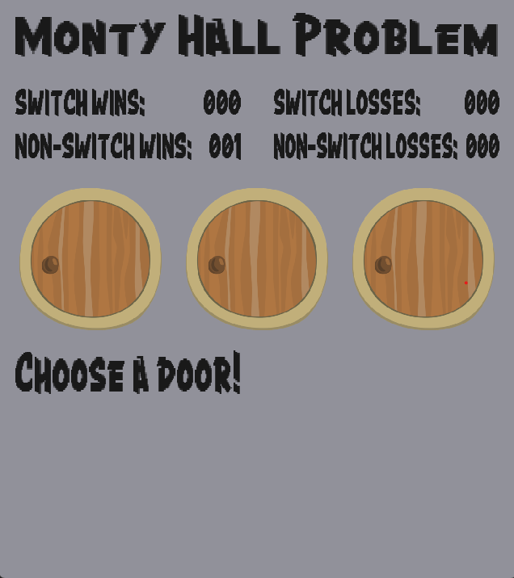
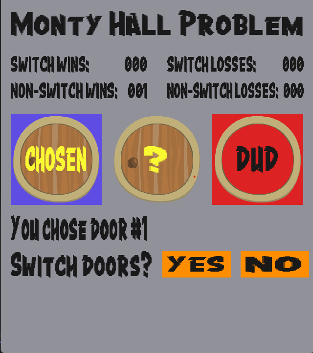
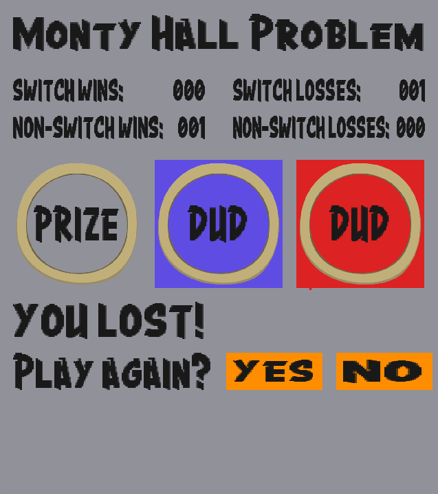

# MONTY HALL PROBLEM

This is a GUI game using C++ and SDL2, to allow the user to play the Monty Hall problem repeatedly and view their cumulative stats.
There are three doors. One of them is the "winner" while the other two are duds.

* Prompt user to pick a door.
* User picks one door.
* We open a "dud" from among the other two doors, to show that it's a dud.
* Then user is prompted to either switch with the other unopened door, or hold onto their current selection.
* Finally we display the results. Is the user's selection the "winner" or a "dud" ? We also display cumulative results, because the whole point is to see whether switching or holding is statistically advantageous.

## Technical requirements

We're using C++ 20, importing an **.ixx** module.

### Requires SDL2 libraries:

[SDL2](https://github.com/libsdl-org/SDL/releases/tag/release-2.30.9) (main library)

[SDL2_image_](https://github.com/libsdl-org/SDL_image/releases) (for images)

[SDL2_ttf_](https://github.com/libsdl-org/SDL_ttf/releases) (for fonts)

## Images

**Phase 1 (choose a door)**

**Phase 2 (switch doors or hold current selection)**

**Phase 1 (results)**

